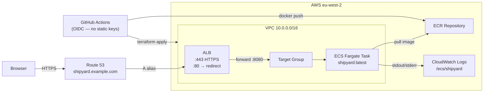

# Shipyard ⚓

A minimal Go web service deployed to AWS ECS Fargate with HTTPS, a custom domain, and automated CI/CD. Built to practice the full journey: ClickOps → Terraform → GitHub Actions.

---

## Architecture



---

## What's in the repo

```
├── app/                    Go HTTP server (stdlib only)
├── Dockerfile              Multi-stage build → ~6 MB scratch image
├── .dockerignore
├── infra/
│   ├── main.tf             Wires all modules + Route 53 A record
│   ├── provider.tf         AWS provider + S3 backend
│   ├── variables.tf
│   ├── outputs.tf
│   └── modules/
│       ├── vpc/            VPC, 2 public subnets, IGW
│       ├── ecr/            ECR repo + lifecycle policy
│       ├── alb/            ALB, SGs, HTTP→HTTPS redirect, HTTPS listener
│       ├── ecs/            Cluster, task def, Fargate service, IAM roles
│       └── acm/            ACM certificate + Route 53 DNS validation
├── .github/workflows/
│   ├── build-push.yml      Build image → push to ECR → force redeploy
│   └── deploy.yml          Terraform fmt/validate/plan/apply
└── README.md
```

---

## Prerequisites

- AWS account with a Route 53–managed domain
- Docker installed locally
- Go 1.22+ (to run the app locally without Docker)
- Terraform ≥ 1.8
- GitHub repository with Actions enabled

---

## Step 1 — Run the app locally

```bash
cd app
go run .
# shipyard listening on :8080

curl http://localhost:8080/health
# {"status":"ok"}
```

---

## Step 2 — Build and run with Docker

```bash
docker build -t shipyard .
docker run -p 8080:8080 shipyard
curl http://localhost:8080/health
```

The final image is built on `scratch` — no shell, no OS, just the binary. It comes out around 5–6 MB.

---

## Step 3 — Push to ECR (manual, before Terraform)

```bash
aws ecr create-repository --repository-name shipyard --region eu-west-2

aws ecr get-login-password --region eu-west-2 \
  | docker login --username AWS --password-stdin \
    <account-id>.dkr.ecr.eu-west-2.amazonaws.com

docker tag shipyard <account-id>.dkr.ecr.eu-west-2.amazonaws.com/shipyard:latest
docker push <account-id>.dkr.ecr.eu-west-2.amazonaws.com/shipyard:latest
```

---

## Step 4 — ClickOps first (do this before Terraform!)

Manually wire up the full stack in the AWS console so you understand what every piece is actually doing. Use the checklist below, then **tear it all down** before moving to Terraform.

- [ ] Create an ECS cluster (Fargate)
- [ ] Create a task definition using your ECR image
- [ ] Create a VPC with two public subnets in different AZs
- [ ] Create an Application Load Balancer across both subnets
- [ ] Add a security group: allow 80 + 443 inbound, forward to task port (8080)
- [ ] Create a target group (IP target type, health check on `/health`)
- [ ] Request an ACM certificate for `shipyard.yourdomain.com` (DNS validation)
- [ ] Add a Route 53 CNAME for ACM validation, wait for "Issued"
- [ ] Add an A alias record pointing to the ALB
- [ ] Attach the cert to the ALB HTTPS listener, add HTTP→HTTPS redirect
- [ ] Verify `https://shipyard.yourdomain.com/health` returns `{"status":"ok"}`
- [ ] Delete everything

> **Screenshot** — _add a screenshot of the console with the app live here_

---

## Step 5 — Terraform (rebuild it properly)

### Bootstrap: create the state bucket (once)

```bash
aws s3api create-bucket \
  --bucket your-tf-state-bucket \
  --region eu-west-2 \
  --create-bucket-configuration LocationConstraint=eu-west-2

aws s3api put-bucket-versioning \
  --bucket your-tf-state-bucket \
  --versioning-configuration Status=Enabled
```

Update the `bucket` value in [infra/provider.tf](infra/provider.tf).

### Deploy

```bash
cd infra
terraform init
terraform plan -var="domain_name=yourdomain.com"
terraform apply -var="domain_name=yourdomain.com"
```

ACM validation can take 2–5 minutes. Terraform waits automatically.

After apply:

```bash
terraform output app_url
# https://shipyard.yourdomain.com

curl $(terraform output -raw app_url)/health
# {"status":"ok"}
```

> **Screenshot** — _add a screenshot of `terraform apply` completing here_

---

## Step 6 — CI/CD with GitHub Actions

Two separate pipelines, separated by concern:

| Workflow | Trigger | Does |
|---|---|---|
| `build-push.yml` | push to any branch touching `app/` or `Dockerfile` | Build image, push to ECR, force ECS redeploy on `main` |
| `deploy.yml` | push to `main` touching `infra/` or manual dispatch | `terraform fmt` → `validate` → `plan` → `apply` |

### GitHub Secrets required

| Secret | Value |
|---|---|
| `AWS_ROLE_ARN` | IAM role ARN for OIDC (see below) |
| `ECR_REPOSITORY` | `shipyard` |
| `DOMAIN_NAME` | `yourdomain.com` |
| `APP_SUBDOMAIN` | `shipyard` |

### OIDC IAM role (no static keys)

Create a role that GitHub Actions can assume via OIDC:

```bash
# In the AWS Console:
# IAM → Identity providers → Add provider
#   Provider type: OpenID Connect
#   Provider URL:  https://token.actions.githubusercontent.com
#   Audience:      sts.amazonaws.com

# Then create a role with the trust policy below and attach:
#   - AmazonECSFullAccess (or a scoped-down custom policy)
#   - AmazonEC2ContainerRegistryFullAccess (or scope to your repo)
#   - For Terraform: AdministratorAccess (tighten this in production)
```

Trust policy (replace `ORG/REPO`):

```json
{
  "Version": "2012-10-17",
  "Statement": [{
    "Effect": "Allow",
    "Principal": {
      "Federated": "arn:aws:iam::<account-id>:oidc-provider/token.actions.githubusercontent.com"
    },
    "Action": "sts:AssumeRoleWithWebIdentity",
    "Condition": {
      "StringLike": {
        "token.actions.githubusercontent.com:sub": "repo:ORG/REPO:*"
      },
      "StringEquals": {
        "token.actions.githubusercontent.com:aud": "sts.amazonaws.com"
      }
    }
  }]
}
```

> **Screenshot** — _add a screenshot of a successful pipeline run here_

---

## Deploying a new image

Pushing any change under `app/` triggers `build-push.yml` automatically. On `main` it also force-redeploys the ECS service, so the new image goes live within ~60 seconds without a Terraform apply.

```bash
# Manual force redeploy (if needed)
aws ecs update-service --cluster shipyard --service shipyard \
  --force-new-deployment --region eu-west-2
```

---

## Live deployment

> **Screenshot** — _add a screenshot of the app at `https://shipyard.yourdomain.com` here_

URL: `https://shipyard.yourdomain.com`

---

## Cleanup

```bash
cd infra
terraform destroy -var="domain_name=yourdomain.com"

# Delete the ECR images first if destroy fails on the repository
aws ecr delete-repository --repository-name shipyard --force --region eu-west-2
```

---

## Useful links

- [Terraform AWS ECS docs](https://registry.terraform.io/providers/hashicorp/aws/latest/docs/resources/ecs_cluster)
- [ECS Fargate networking](https://docs.aws.amazon.com/ecs/latest/userguide/fargate-task-networking.html)
- [GitHub Actions OIDC with AWS](https://docs.github.com/en/actions/security-for-github-actions/security-hardening-your-deployments/configuring-openid-connect-in-amazon-web-services)
- [ACM DNS validation with Terraform](https://registry.terraform.io/providers/hashicorp/aws/latest/docs/resources/acm_certificate_validation)
