# Shipyard ⚓

A containerised Go web service deployed to AWS ECS Fargate with HTTPS, a custom domain, and automated CI/CD. Built to practice the full journey: ClickOps → Terraform → GitHub Actions.

The app serves a runtime dashboard that introspects its own environment — it reads the ECS Task Metadata Endpoint v4 to report the live AWS region, availability zone, cluster, and task ID it's currently running on, plus the build SHA and Go runtime stats. Useful for proving "yes this is actually live on Fargate, here's the task that's serving you right now."

**Live:** [https://shipyard.saram-khan.site](https://shipyard.saram-khan.site)

---

## Architecture

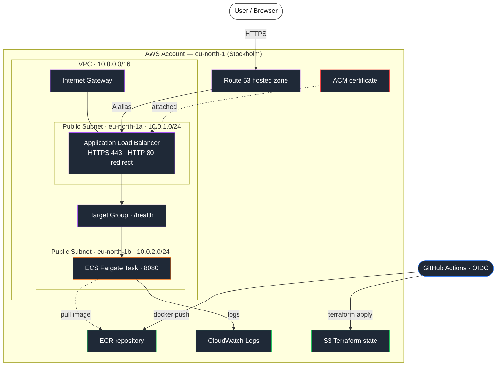

---

## What's in the repo

```
├── app/                    Go HTTP server (stdlib only)
├── Dockerfile              Multi-stage build → ~6 MB scratch image
├── .dockerignore
├── infra/
│   ├── main.tf             Wires all modules + Route 53 A record
│   ├── provider.tf         AWS provider + S3 backend
│   ├── variables.tf
│   ├── outputs.tf
│   └── modules/
│       ├── vpc/            VPC, 2 public subnets, IGW
│       ├── ecr/            ECR repo + lifecycle policy
│       ├── alb/            ALB, SGs, HTTP→HTTPS redirect, HTTPS listener
│       ├── ecs/            Cluster, task def, Fargate service, IAM roles
│       └── acm/            ACM certificate + Route 53 DNS validation
├── .github/workflows/
│   ├── build-push.yml      Build image → push to ECR → force ECS redeploy
│   ├── plan.yml            fmt / validate / tflint / plan on PRs + non-main pushes
│   ├── deploy.yml          fmt / validate / plan / apply / health check on main
│   └── destroy.yml         Manual teardown with confirmation guard
└── README.md
```

---

## Prerequisites

- AWS account (Free Tier works, but Route 53 domain registration requires a paid account — see notes below)
- A domain you control. If your account is on Free Tier, register elsewhere (Porkbun, Namecheap, etc.) and delegate the nameservers to a Route 53 hosted zone
- Docker installed locally (Docker Desktop on macOS)
- Terraform ≥ 1.8 (`brew install hashicorp/tap/terraform`)
- AWS CLI v2 (`brew install awscli`)
- GitHub repository with Actions enabled
- Go 1.22+ (only if you want to run the app locally without Docker)

---

## App endpoints

| Route | Returns | Used by |
|---|---|---|
| `GET /` | HTML dashboard — Runtime · AWS · Build · System cards | Humans / portfolio screenshots |
| `GET /health` | `{"status":"ok"}` | ALB target group health check |
| `GET /api/info` | Full runtime snapshot as JSON | Curl, monitoring, scripts |

The AWS card on `/` pulls live data from the ECS Task Metadata Endpoint v4 (`ECS_CONTAINER_METADATA_URI_V4`), so the displayed region / AZ / task ID belong to the *actual* Fargate task serving the request. Run the same image locally and the card gracefully says "not running on ECS."

`GET /health` and `GET /api/info` use content negotiation — `curl` (and the ALB target-group probe) get the canonical JSON, while a browser opening the same URL is served a styled page. `/health` renders an "All systems go" status card with live vitals and an inline ECG line; `/api/info` renders a Runtime Snapshot diagnostic with stat tiles and grouped detail cards for the cloud environment, build, and system.

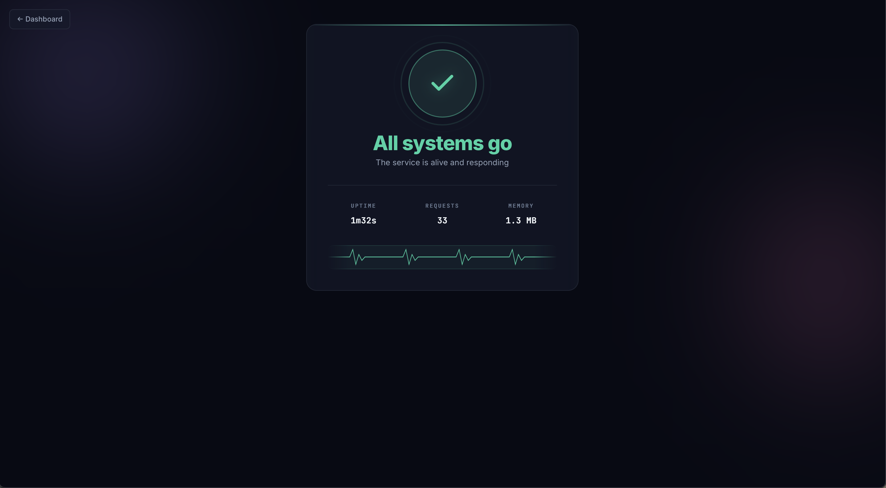
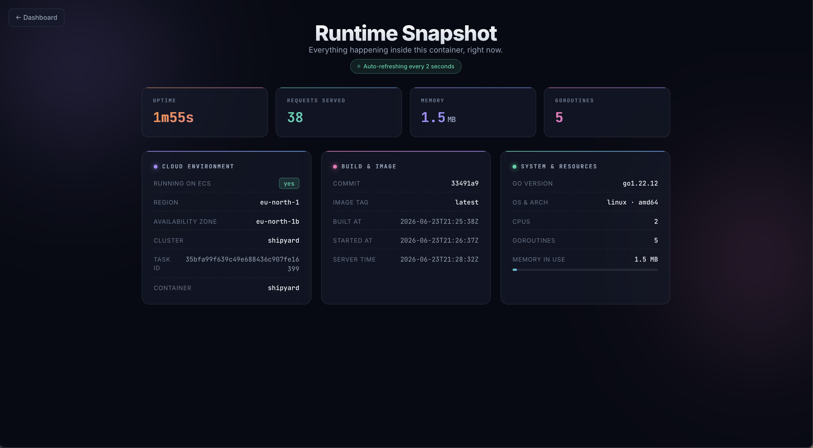

---

## Step 1 — Run the app locally

With Go installed:

```bash
cd app
go run .
# shipyard listening on :8080
```

Or via Docker (no Go required):

```bash
docker build --platform linux/amd64 -t shipyard:local .
docker run --rm -p 8080:8080 shipyard:local
```

Then in your browser open **http://localhost:8080** for the dashboard, or:

```bash
curl http://localhost:8080/health
# {"status":"ok"}

curl http://localhost:8080/api/info
# {"Status":"ok","Uptime":"3s","StartedAt":"...","AWS":{"Available":false,...}, ...}
```

Build metadata (commit SHA, build time) is injected via `-ldflags` from the Dockerfile's `--build-arg` values — set by the `build-push.yml` workflow on every CI build, so every image carries its provenance.

---

## Step 2 — Build and run with Docker

```bash
docker build -t shipyard .
docker run -p 8080:8080 shipyard
curl http://localhost:8080/health
```

The final image is built on `scratch` — no shell, no OS, just the binary. It comes out around 5–6 MB.

---

## Step 3 — Push to ECR (manual, before Terraform)

```bash
aws ecr create-repository --repository-name shipyard --region eu-north-1

aws ecr get-login-password --region eu-north-1 \
  | docker login --username AWS --password-stdin \
    <account-id>.dkr.ecr.eu-north-1.amazonaws.com

docker tag shipyard <account-id>.dkr.ecr.eu-north-1.amazonaws.com/shipyard:latest
docker push <account-id>.dkr.ecr.eu-north-1.amazonaws.com/shipyard:latest
```

---

## Step 4 — ClickOps first (do this before Terraform!)

Manually wire up the full stack in the AWS console so you understand what every piece is actually doing. Use the checklist below, then **tear it all down** before moving to Terraform.

- [ ] Create an ECS cluster (Fargate)
- [ ] Create a task definition using your ECR image
- [ ] Create a VPC with two public subnets in different AZs
- [ ] Create an Application Load Balancer across both subnets
- [ ] Add a security group: allow 80 + 443 inbound, forward to task port (8080)
- [ ] Create a target group (IP target type, health check on `/health`)
- [ ] Request an ACM certificate for `shipyard.yourdomain.com` (DNS validation)
- [ ] Add a Route 53 CNAME for ACM validation, wait for "Issued"
- [ ] Add an A alias record pointing to the ALB
- [ ] Attach the cert to the ALB HTTPS listener, add HTTP→HTTPS redirect
- [ ] Verify `https://shipyard.yourdomain.com/health` returns `{"status":"ok"}`
- [ ] Delete everything

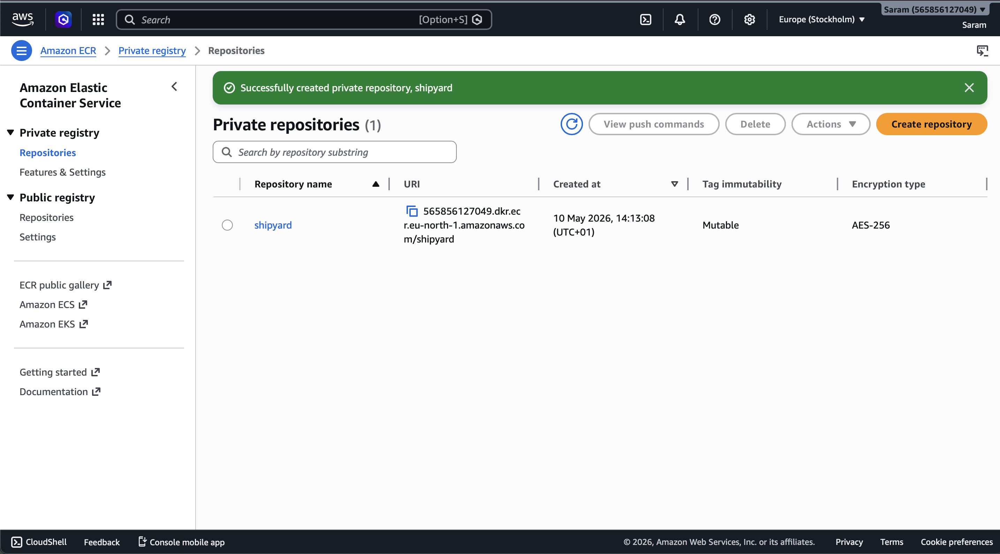
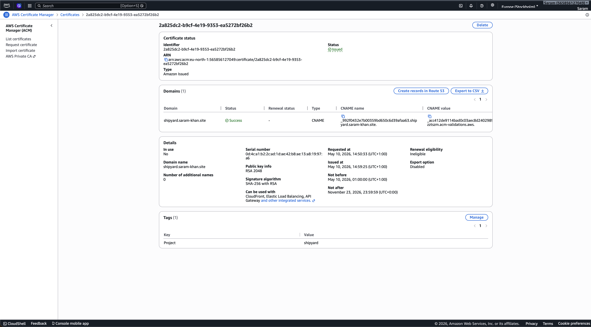
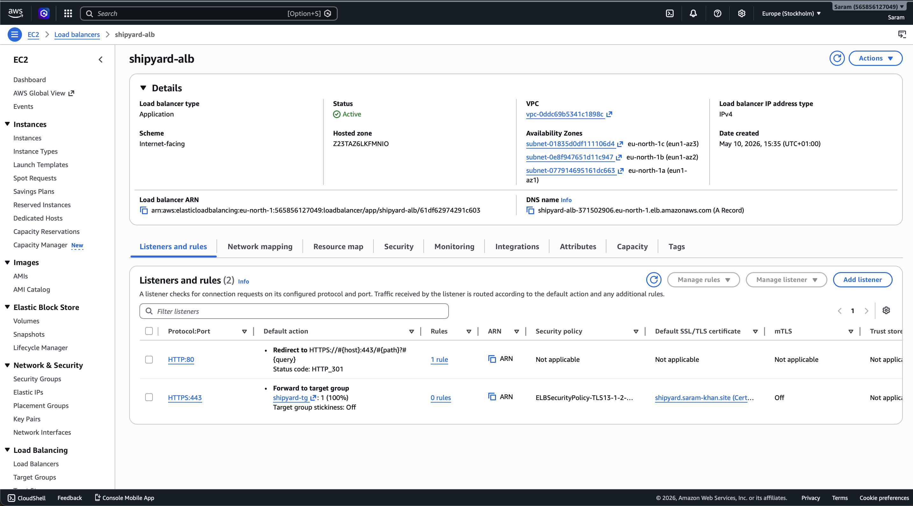
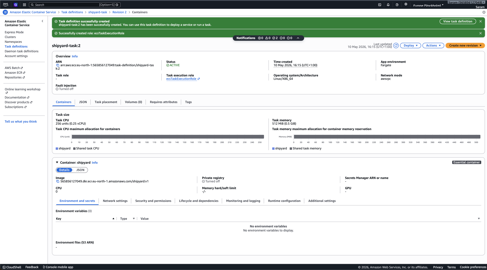
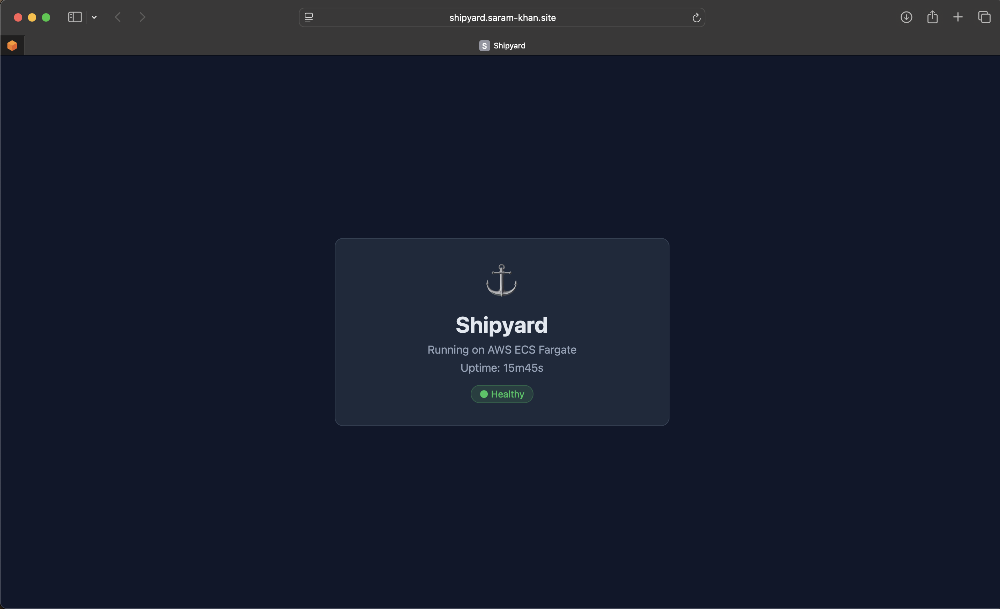
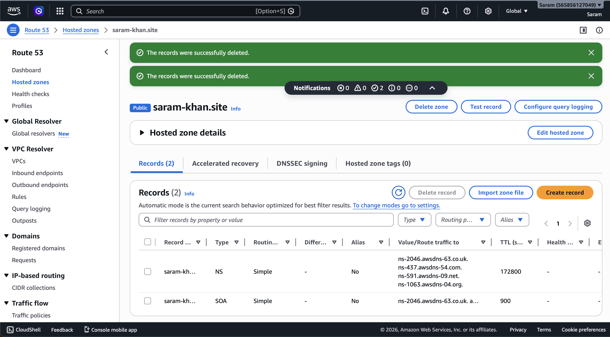

---

## Step 5 — Terraform (rebuild it properly)

### Bootstrap: create the state bucket + lock table (once)

```bash
# S3 bucket — versioning, encryption, public access blocked
aws s3api create-bucket \
  --bucket your-tf-state-bucket \
  --region eu-north-1 \
  --create-bucket-configuration LocationConstraint=eu-north-1

aws s3api put-bucket-versioning \
  --bucket your-tf-state-bucket \
  --versioning-configuration Status=Enabled

aws s3api put-public-access-block \
  --bucket your-tf-state-bucket \
  --public-access-block-configuration \
    "BlockPublicAcls=true,IgnorePublicAcls=true,BlockPublicPolicy=true,RestrictPublicBuckets=true"

aws s3api put-bucket-encryption \
  --bucket your-tf-state-bucket \
  --server-side-encryption-configuration \
    '{"Rules":[{"ApplyServerSideEncryptionByDefault":{"SSEAlgorithm":"AES256"}}]}'

# DynamoDB lock table — prevents concurrent applies
aws dynamodb create-table \
  --table-name shipyard-tfstate-lock \
  --attribute-definitions AttributeName=LockID,AttributeType=S \
  --key-schema AttributeName=LockID,KeyType=HASH \
  --billing-mode PAY_PER_REQUEST \
  --region eu-north-1
```

Update the `bucket` value in [infra/provider.tf](infra/provider.tf).

### Configure your variables

```bash
cd infra
cp terraform.tfvars.example terraform.tfvars
# edit terraform.tfvars with your domain name
```

### Deploy in two phases

ECR has to exist before the ECS task definition can reference an image, so we apply ECR first, push the image, then apply everything else:

```bash
terraform init

# Phase 1 — ECR only
terraform apply -target=module.ecr -var-file=terraform.tfvars

# Push the image to the new ECR repo
ECR_URL=$(terraform output -raw ecr_repo_url)
aws ecr get-login-password --region eu-north-1 \
  | docker login --username AWS --password-stdin "${ECR_URL%/*}"
docker build --platform linux/amd64 -t shipyard:latest ..
docker tag shipyard:latest "${ECR_URL}:latest"
docker push "${ECR_URL}:latest"

# Phase 2 — everything else
terraform plan -var-file=terraform.tfvars -out=tfplan
terraform apply tfplan
```

ACM validation takes 2–5 minutes. Terraform waits automatically.

After apply:

```bash
terraform output app_url
# https://shipyard.yourdomain.com

curl $(terraform output -raw app_url)/health
# {"status":"ok"}
```

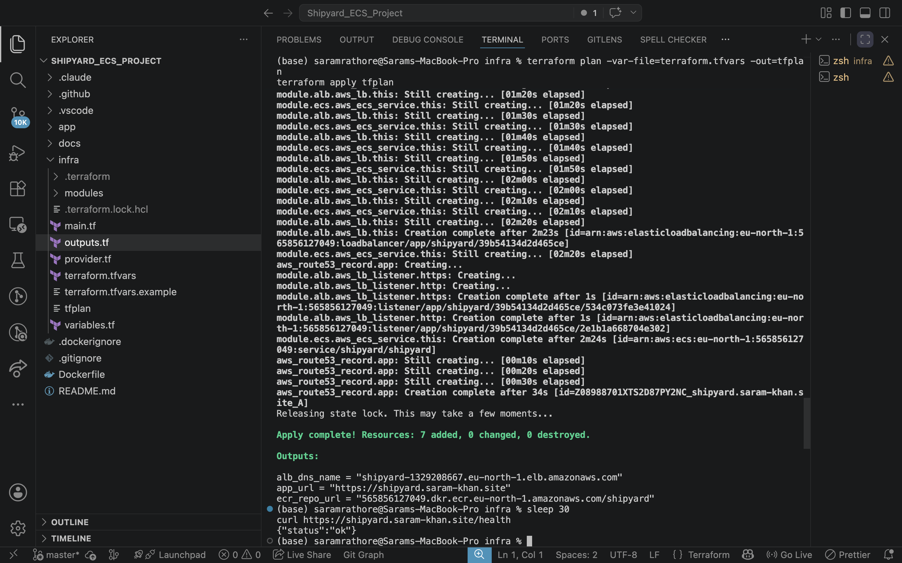
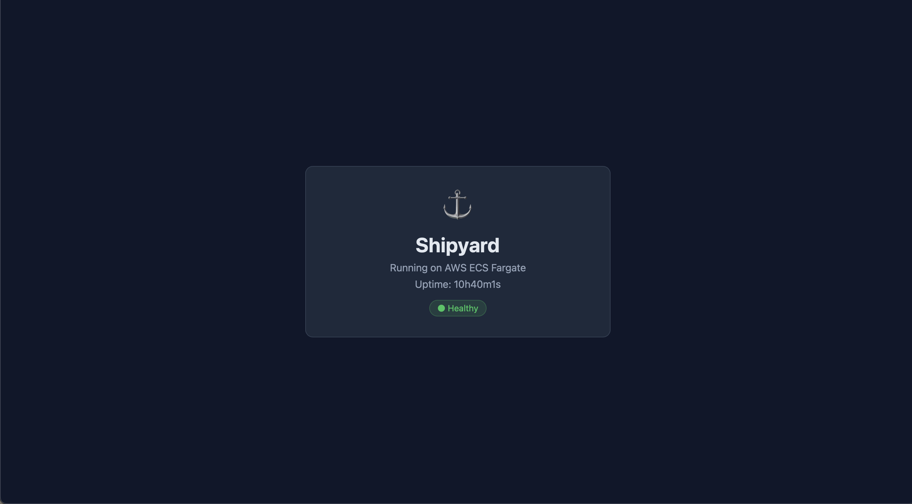

---

## Step 6 — CI/CD with GitHub Actions

Four separate pipelines, separated by concern:

| Workflow | Trigger | Does |
|---|---|---|
| `build-push.yml` | push to any branch touching `app/` or `Dockerfile` | Build image, push to ECR (tagged with SHA + latest on main), force ECS redeploy on `main` |
| `plan.yml` | PR to `main` or push to non-main branches touching `infra/` | `terraform fmt -check` → `init` → `validate` → `tflint` → `plan` |
| `deploy.yml` | push to `main` touching `infra/` or manual dispatch | `terraform fmt` → `validate` → `plan` → `apply` → post-deploy health check |
| `destroy.yml` | manual dispatch only, requires typing `destroy` to confirm | Empties ECR repo → `terraform destroy` |

### GitHub Secrets required

| Secret | Value |
|---|---|
| `AWS_ROLE_ARN` | IAM role ARN for OIDC (see below) |
| `ECR_REPOSITORY` | `shipyard` |
| `DOMAIN_NAME` | `yourdomain.com` |
| `APP_SUBDOMAIN` | `shipyard` |

### OIDC IAM role (no static keys)

```bash
# 1. Create the OIDC provider (once per account)
aws iam create-open-id-connect-provider \
  --url https://token.actions.githubusercontent.com \
  --client-id-list sts.amazonaws.com \
  --thumbprint-list 6938fd4d98bab03faadb97b34396831e3780aea1

# 2. Trust policy — restrict to your repo
cat > /tmp/trust-policy.json <<'EOF'
{
  "Version": "2012-10-17",
  "Statement": [{
    "Effect": "Allow",
    "Principal": {
      "Federated": "arn:aws:iam::<account-id>:oidc-provider/token.actions.githubusercontent.com"
    },
    "Action": "sts:AssumeRoleWithWebIdentity",
    "Condition": {
      "StringEquals": {
        "token.actions.githubusercontent.com:aud": "sts.amazonaws.com"
      },
      "StringLike": {
        "token.actions.githubusercontent.com:sub": "repo:ORG/REPO:*"
      }
    }
  }]
}
EOF

# 3. Create the role and attach a policy
aws iam create-role \
  --role-name shipyard-github-actions \
  --assume-role-policy-document file:///tmp/trust-policy.json

aws iam attach-role-policy \
  --role-name shipyard-github-actions \
  --policy-arn arn:aws:iam::aws:policy/AdministratorAccess
# (Tighten in production — scope to ECR + ECS + ELB + Route53 + ACM + IAM(role:shipyard-*) + S3(state) + DynamoDB(lock).)

# 4. Get the role ARN — set as AWS_ROLE_ARN secret in GitHub
aws iam get-role --role-name shipyard-github-actions --query 'Role.Arn' --output text
```

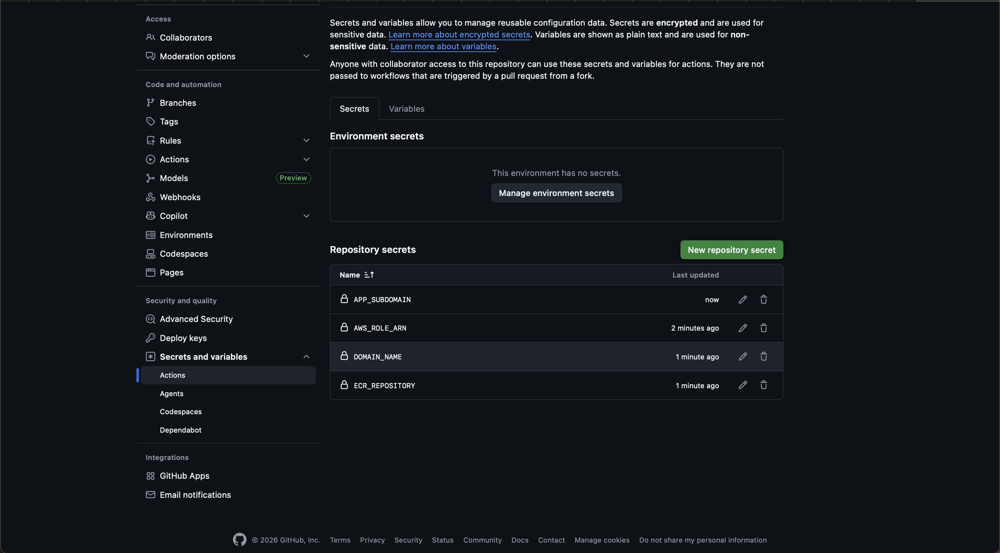

**Build & Push** — image built, tagged with the commit SHA, pushed to ECR, then forces an ECS rolling redeploy:

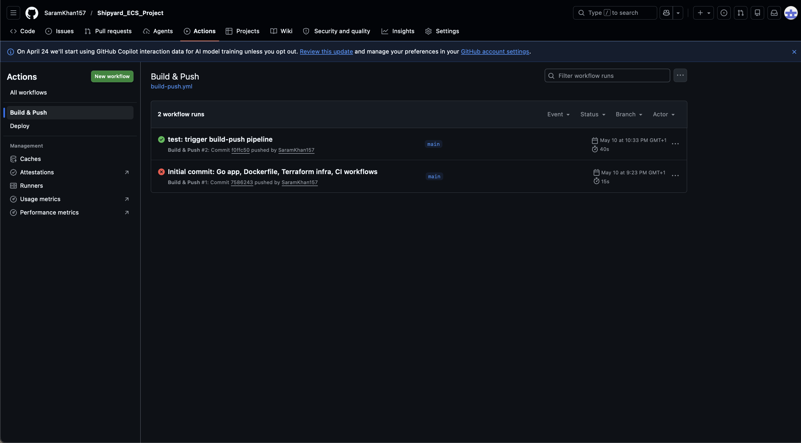

**Plan** — runs `fmt`, `validate`, `tflint`, and `plan` on PRs and non-main pushes. Catches drift and lint issues before they hit `main`:

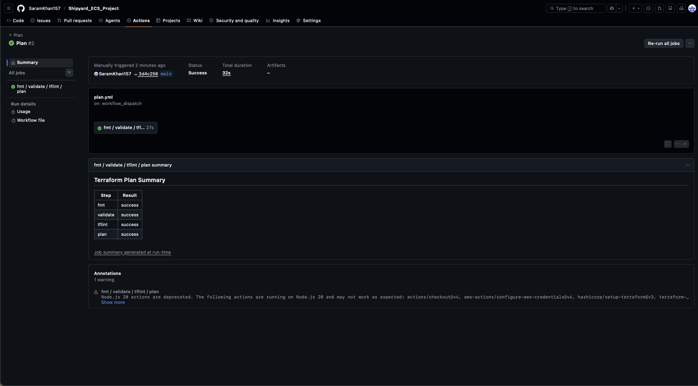

**Deploy** — `terraform apply` on push to `main` (or manual dispatch), followed by a post-deploy `/health` check that fails the run if the site is unreachable:


**Destroy** — manual-trigger only, gated by a confirmation input (you have to type `destroy` exactly). Empties the ECR repo first so the `terraform destroy` can remove the repository cleanly:

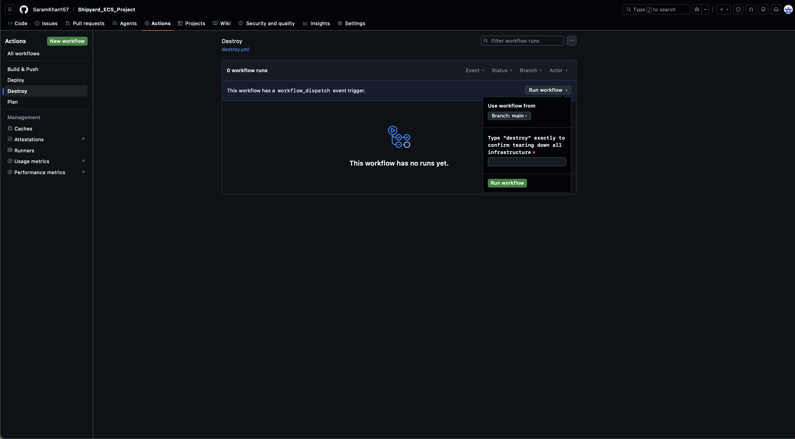

---

## Deploying a new image

Pushing any change under `app/` triggers `build-push.yml` automatically. On `main` it also force-redeploys the ECS service, so the new image goes live within ~60 seconds without a Terraform apply.

```bash
# Manual force redeploy (if needed)
aws ecs update-service --cluster shipyard --service shipyard \
  --force-new-deployment --region eu-north-1
```

---

## Live deployment

URL: **https://shipyard.saram-khan.site**

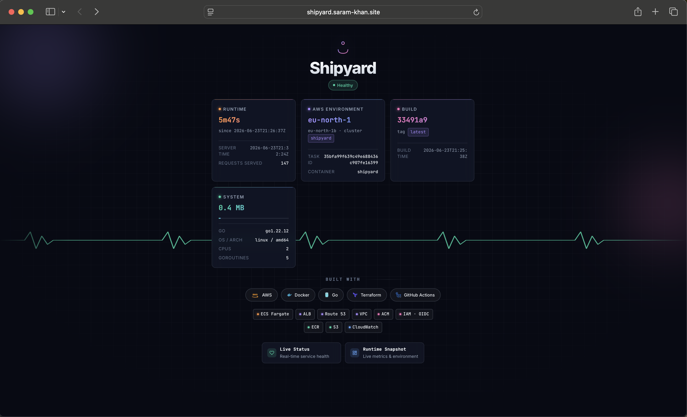

---

## Cleanup

```bash
cd infra
terraform destroy -var-file=terraform.tfvars

# If destroy fails on ECR (because images exist), force-delete it then re-run destroy
aws ecr delete-repository --repository-name shipyard --force --region eu-north-1
terraform destroy -var-file=terraform.tfvars
```

To fully clean up the bootstrap resources too:

```bash
aws s3 rm s3://your-tf-state-bucket --recursive
aws s3api delete-bucket --bucket your-tf-state-bucket --region eu-north-1
aws dynamodb delete-table --table-name shipyard-tfstate-lock --region eu-north-1
```

---

## Lessons learned

A few things I'd do differently / notes from building this end-to-end:

- **ClickOps first really does help.** Doing it by hand once turned every Terraform resource into something I'd already wired up — `aws_ecs_service`, `aws_lb_target_group`, `aws_acm_certificate_validation` all had real meaning instead of just being abstractions.
- **Free Tier accounts can't register Route 53 domains.** Hosted zones work fine, but the Domains service rejects free-tier accounts. Easy workaround: register at a third-party registrar (~$1–3 for `.xyz`/`.click`) and delegate the nameservers to Route 53.
- **Fargate runs amd64.** When building on Apple Silicon, always pass `--platform linux/amd64` to `docker build`, otherwise tasks fail to start with "no matching manifest" errors that take a while to diagnose.
- **Tasks need public IPs in default VPCs.** Without a NAT gateway, the only way Fargate tasks can reach ECR to pull images is via a public IP on their ENI. Set `assign_public_ip = true` on the `network_configuration` block.
- **Em-dashes break SG descriptions.** AWS only accepts ASCII in security group descriptions. The `—` character (U+2014) returns a cryptic `InvalidParameterValue` from the EC2 API.
- **The console wraps ECS cluster creation in CloudFormation.** If the first attempt fails, a stuck `Infra-ECS-Cluster-*` stack blocks all retries. The CLI (`aws ecs create-cluster`) calls the API directly and avoids this pit.
- **Two-phase Terraform apply for the chicken-and-egg.** Creating the ECR repo and the ECS service in one apply means the service tries to pull `:latest` from an empty repo and fails. First apply ECR (`-target=module.ecr`), push the image, then apply the rest.
- **OIDC > static keys, every time.** `configure-aws-credentials@v4` + a JWT-bound IAM role replaces what would otherwise be a long-lived `AWS_ACCESS_KEY_ID` secret rotting in GitHub Settings. The trust policy's `sub` claim ties the role to a specific repo, so even if the role ARN leaked it can't be used outside this repo's Actions runner.

---

## Useful links

- [Terraform AWS ECS docs](https://registry.terraform.io/providers/hashicorp/aws/latest/docs/resources/ecs_cluster)
- [ECS Fargate networking](https://docs.aws.amazon.com/ecs/latest/userguide/fargate-task-networking.html)
- [GitHub Actions OIDC with AWS](https://docs.github.com/en/actions/security-for-github-actions/security-hardening-your-deployments/configuring-openid-connect-in-amazon-web-services)
- [ACM DNS validation with Terraform](https://registry.terraform.io/providers/hashicorp/aws/latest/docs/resources/acm_certificate_validation)
